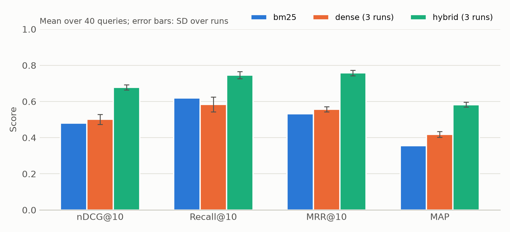

# reteval

[](https://github.com/nurzhvn52/reteval/actions/workflows/ci.yml)
[](https://github.com/nurzhvn52/reteval/releases)
[](LICENSE)


Reproducible evaluation of ranked retrieval runs. `reteval` reads TREC-style relevance
judgements and runs, computes standard IR metrics, averages repeated runs of the same
system (for example, models trained with different random seeds) and tests whether a
system is better than a baseline.

It was written for the experiments of a master's thesis on retrieval-augmented agents for
regulatory documents. There every claim has the form "method A outperforms baseline B on
metric M" and has to be backed by several runs, their variance and a significance test.

## Why

Evaluation tools such as `trec_eval` report one number per run. For experiments with
learned models this hides two things: how much the result moves between random seeds, and
whether the gain over the baseline is larger than the noise between queries. `reteval`
reports both:

- **mean ± standard deviation over repeated runs**, so the variance between seeds is visible;
- **a paired randomization test and a bootstrap confidence interval** for the difference to a
  baseline, computed per query;
- **per-query scores** as CSV, to study failure cases instead of averages only.

Every random procedure takes an explicit seed, so the same inputs always give the same
report. Libraries such as [ranx](https://github.com/AmenRa/ranx) offer more metrics and
tests; `reteval` is deliberately small (two runtime dependencies, one command) and treats
repeated runs of a system as a first-class input.

## Installation

```bash
pip install "git+https://github.com/nurzhvn52/reteval.git@v0.1.0"
```

or download the wheel from [Releases](https://github.com/nurzhvn52/reteval/releases) and
`pip install reteval-0.1.0-py3-none-any.whl`. Python 3.11 or newer is required.

## Quick start

The repository contains a [synthetic example](examples/README.md): a BM25 baseline, a dense
retriever with three seeds and a hybrid of the two, on 40 queries.

```bash
reteval evaluate --qrels examples/data/qrels.txt \
  --run bm25=examples/data/runs/bm25.run \
  --run "dense=examples/data/runs/dense.seed*.run" \
  --run "hybrid=examples/data/runs/hybrid.seed*.run" \
  --metrics ndcg@10 recall@10 mrr@10 map \
  --baseline bm25 --plot report.png --per-query per_query.csv
```

Output (shortened, full version in [examples/expected/report.md](examples/expected/report.md)):

| System | Runs | nDCG@10 | Recall@10 | MRR@10 | MAP |
| --- | ---: | ---: | ---: | ---: | ---: |
| bm25 | 1 | 0.4798 | 0.6196 | 0.5328 | 0.3551 |
| dense | 3 | 0.5016 ± 0.0277 | 0.5840 ± 0.0413 | 0.5566 ± 0.0146 | 0.4182 ± 0.0164 |
| hybrid | 3 | 0.6782 ± 0.0147 | 0.7462 ± 0.0190 | 0.7585 ± 0.0152 | 0.5825 ± 0.0136 |

| System | Metric | Difference | 95% CI | p |
| --- | --- | ---: | ---: | ---: |
| dense | nDCG@10 | +0.0218 | [-0.1073, +0.1466] | 0.7367 |
| hybrid | nDCG@10 | +0.1984 | [+0.1251, +0.2731] | 0.0001 |

The dense retriever is not distinguishable from BM25, while the hybrid is clearly better.



## Input formats

| File | Line format | Notes |
| --- | --- | --- |
| qrels | `query_id iteration doc_id relevance` | integer grades; grade >= `--min-rel` (default 1) is relevant |
| run | `query_id Q0 doc_id rank score tag` | ordered by score; the rank column is ignored, ties are broken by document id |

Lines starting with `#` are skipped. Malformed input stops with the file name and line
number. Queries without relevant documents are not evaluated. A query missing from a run
scores 0 and a warning is printed, so a system cannot improve its average by skipping
hard queries.

## Metrics

| Name | Meaning |
| --- | --- |
| `p@k` | share of the top k documents that are relevant (denominator is always k) |
| `recall@k` | share of all relevant documents found in the top k |
| `mrr@k` | reciprocal rank of the first relevant document |
| `map@k` | average precision; unretrieved relevant documents count as misses |
| `ndcg@k` | nDCG with graded relevance: gain = grade, discount log2(rank + 1) |
| `hit@k` | 1 if at least one relevant document is in the top k |

Without `@k` the whole ranking is used. `reteval metrics` prints the list.

## Statistics

- **Seed variance.** For a system with n runs, the table shows the mean of the run means and
  their sample standard deviation (n - 1 in the denominator).
- **Paired randomization test.** Scores are first averaged over runs for every query. Under
  the null hypothesis the sign of each per-query difference is arbitrary; the p-value is
  the share of random sign flips whose mean is at least as extreme as the observed one,
  `(extreme + 1) / (resamples + 1)`. This test is recommended for IR evaluation by
  Smucker, Allan and Carterette (CIKM 2007).
- **Bootstrap CI.** A 95% percentile bootstrap interval of the mean per-query difference.

Both use `--resamples` (default 10 000) and `--seed` (default 0). There is no correction
for multiple comparisons yet ([#9](https://github.com/nurzhvn52/reteval/issues/9)), so with
many systems and metrics read the p-values with care.

## Python API

```python
from reteval.evaluation import System, evaluate_run
from reteval.metrics import parse_metric
from reteval.report import build_report, to_markdown
from reteval.trec import read_qrels, read_run

qrels = read_qrels("qrels.txt")
metrics = [parse_metric("ndcg@10"), parse_metric("mrr")]
bm25 = System("bm25", (evaluate_run(read_run("bm25.run"), qrels, metrics),))
runs = [read_run(f"dense.seed{seed}.run") for seed in (1, 2, 3)]
dense = System("dense", tuple(evaluate_run(run, qrels, metrics) for run in runs))
print(to_markdown(build_report([bm25, dense], ["nDCG@10", "MRR"], baseline="bm25")))
```

## Project structure

```
src/reteval/
  trec.py          read qrels and runs
  metrics.py       metric functions and parsing of names like ndcg@10
  evaluation.py    per-query scores of a run; System = repeated runs
  stats.py         summary, randomization test, bootstrap CI
  report.py        result tables in Markdown, CSV and JSON
  plot.py          bar chart
  cli.py           command-line interface
tests/             unit, property-based and end-to-end tests
examples/          synthetic data, its generator and the expected report
.github/           CI and release workflows, Dependabot, issue and PR templates
```

## Development

```bash
git clone https://github.com/nurzhvn52/reteval.git && cd reteval
python -m venv .venv && source .venv/bin/activate   # Windows: .venv\Scripts\activate
pip install -e ".[dev]"

ruff check . && ruff format --check . && mypy && pytest --cov
```

Work is tracked in issues and done in short-lived branches merged through pull requests;
see [CONTRIBUTING.md](CONTRIBUTING.md).

## CI/CD

| Workflow | Trigger | What it does |
| --- | --- | --- |
| [`ci.yml`](.github/workflows/ci.yml) | push to `main`, every pull request | ruff and strict mypy; tests with coverage on Python 3.11-3.14 (Linux) and 3.13 (Windows); recomputes the example in the pinned environment of [`requirements-lock.txt`](requirements-lock.txt) and fails if data or results differ from the committed ones; builds the wheel and sdist and installs them in a clean environment |
| [`release.yml`](.github/workflows/release.yml) | tag `v*` | checks that the tag matches the package version, runs the tests, builds and publishes a GitHub release with the wheel and sdist |
| [Dependabot](.github/dependabot.yml) | monthly | pull requests for new versions of actions and Python packages; the reproducibility job shows whether an update changes results |

`main` is protected: a pull request can be merged only when the CI checks pass.

## Technology choices

| Need | Choice | Reason |
| --- | --- | --- |
| Language | Python 3.11+ | the thesis pipeline (retrievers, LLM agents) is in Python, so runs and evaluation share one environment |
| Numerics | NumPy | vectorised resampling; the only heavy dependency besides plotting |
| Charts | Matplotlib | static PNG/PDF for papers, works without a display |
| CLI | argparse | standard library, no extra dependency |
| Tests | pytest, Hypothesis, pytest-cov | readable tests, property-based checks of metric invariants, coverage gate |
| Code quality | Ruff, mypy (strict) | one fast tool for lint and formatting; types catch errors before tests do |
| Packaging | pyproject.toml, Hatchling | standard metadata (PEP 621), console script `reteval` |
| CI/CD | GitHub Actions | code, issues and pipelines in one place, free for public repositories |

## Citing

If you use `reteval` in academic work, please cite it with the metadata in
[CITATION.cff](CITATION.cff) (GitHub shows it under "Cite this repository").

## License

[MIT](LICENSE)
